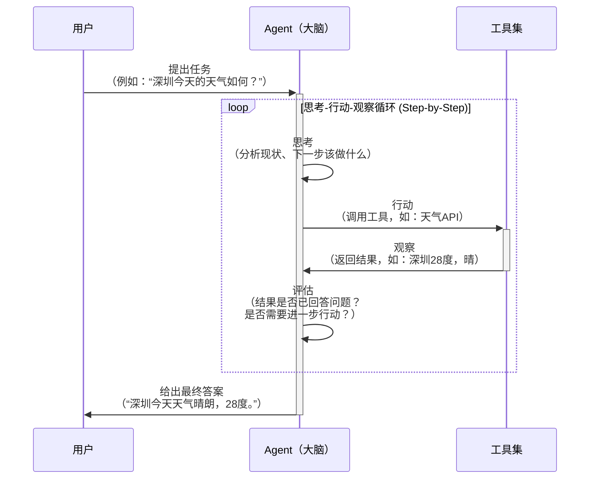
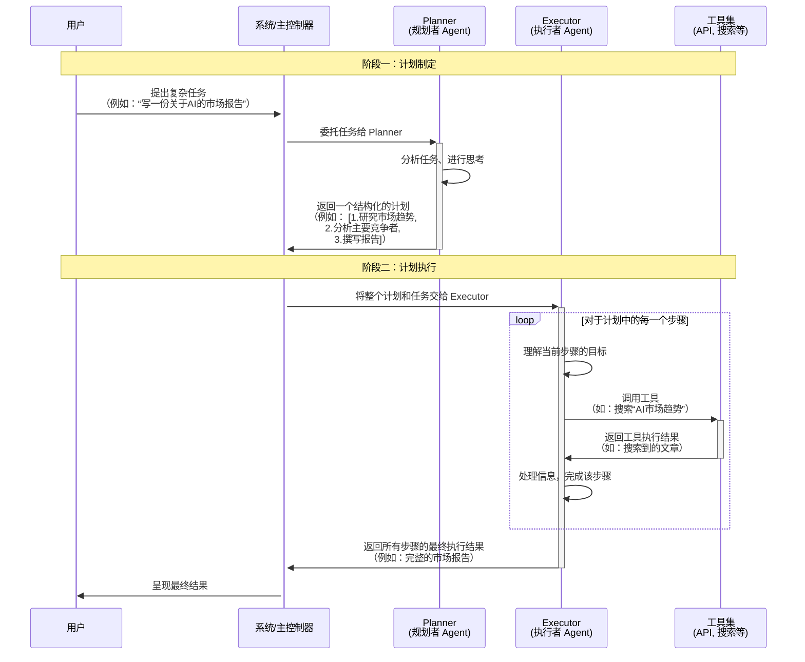

# 动手打造一个自动发 KM 文章的 Agent

> 最终卡在了发布 KM 的工具上 😄😄😄。
>
> 通过案例来介绍如何实现一个 Agent。

AI agent，一个随着大模型热潮而兴起的重要概念，本来主要介绍一下
- Agent 是什么
- Agent 如何运作的
- Agent 要怎么实现 

## 1. Agent 是什么
当前的 LLM 无论是回答问题、还是逻辑能力都很强。

但，LLM 有一个明显的限制，那就是无法感知、操作外部环境，举个例子说明；我们要写一篇介绍 Agent 的文章，需要图文并茂，并发到 KM 。这时候，你把需求告诉 LLM ，它会给你输出一段 markdown 格式的文字，图片通过文字说明或者 XML 格式返回，如下：


很明显，输出的内容我们没办法直接使用，没有达到预期的效果，我们还需要做很多事情

- 将文字复制到自己熟悉的文稿里并重新排版
- 自己绘制图片或者把返回的图片说明丢到 midjourney 或者文生图模型里
- 复制图片并填入到文档中
- 填入图片后，需要修改图片说明使得说明和图片契合，因此重新把文稿发给 LLM
- 修改完后发布到 KM

那这时候聪明的你会想，要是这些都能自动做就好了。然后，无敌的你就开始思考了

- 复制文稿并排版 -> 提供一个 write_document_to_file 工具就可以解决了
- 绘制图片 -> 提供一个 draw_image 工具就行了
- 重新发送给 LLM -> 提供一个 read_document 和 send_message_to_LLM 就行了
- 发布到 KM -> 提供一个 publish_to_KM 工具

假设这些工具都完备了，并且 LLM 可以自己地去按需调用这些工具和根据工具的反馈决定是否继续是结束还是继续调用，那么，这最后一公里的问题就得到了解决，AI 也就是真 AI 了。

Agent 便是解决这最后一公里的方案。


## 2. Agent 如何运作的

完成上述任务的方式有很多种，既可以一步步地来实现，走一步看一步的方式；也可以先做好计划，按照计划按部就班地来。Agent 的运行也是如此，多种式来运行。

### 2.1 ReAct：**让 AI 拥有“三思而后行”的能力**

#### 2.1.1 ReAct

其中最有名的一种是 ReAct：**Re**asoning and **Act**ion

ReAct 将推理和行动 结合在一起。它的核心思想是：**让AI在执行每一步操作之前，先进行一步思考，“为什么”要这么做，然后再做**。

这其实是模仿了人类解决问题的方式。比如，当被问到“阿根廷现任总统的夫人是谁？”时，你不会直接凭空猜测，而是会先思考一下，然后去翻书或者查元宝。

ReAct 可能是目前使用最为广泛的 agent 运行模式，这个模式最初由 2022 年10月份的一篇论文提出， https://arxiv.org/abs/2210.03629 虽然距离现在已经有接近三年的时间了，但是它所提出的agent的运行模式，仍然有着非常广泛的使用。

在这种模式下

- 用户先提交任务

- 然后agent先做思考，thought

- 它思考后会决定是否调用工具

  - 如果是的话，它便会去调用合适的工具，比如读取文档，写入文档内容之类的 
  - react称这一步是行动 英文是action 
  - 在行动后 agent会去查看工具的执行结果 比如所读取的文档内容、写入是否成功等
  - react称这一步是观察 也就是观察工具执行结果 英文是observation 
  - 在观察之后 react 会继续思考 它会再次判断是否需要调用工具 如果还是需要的话 它就会继续重复之前所说的行动 观察思考的流程 直到某个时刻 

- 它认为不需要再调用工具了 可以直接给出结论了 此时它就输出了最终答案 英文是final answer 整个流程到此结束 

  从这个流程图里面也可以看出ReAct 流程的内核步骤是 thought action observation 和 final answer




#### 2.1.2 ReAct 模式是如何实现的

了解了 ReAct 模式的流程之后，下一个问题就是，这种模式是如何实现的，为什么模型拿到用户问题之后，会先思考，再行动，它为什么不直接处理，就像我们使用普通的 Chat 一样，是因为特定的训练模型吗？其实不是的，这与模型的训练过程关系不大，它的奥秘就在于系统提示词上。

ReAct 模式下，系统提示词会是与用户的问题一起提交给模型，系统提示词规定了模型的角色、运行时要遵守的规则、以及各种环境的信息等等。

- 角色：定义 Agent 的身份，比如专业切图仔、设计师、炒股大师
- 运行时要遵守的规则：定义执行规则，比如执行顺序和输出规范
- 各种环境的信息：比如可用工具、系统信息

举个实际的例子，以下是系统提示词：

``` 
你需要解决一个问题，为此，请将问题分解为多个步骤。
1. 首先思考要做什么 <thought>
2. 然后查看是否有可用工具 <action>
3. 然后你将根据你的行动从上下文/工具中收到一个结果 <observation>
4. 持续这个思考和行动的过程，直到你有足够的信息来提供 <final_answer>

所有步骤请严格使用以下 XML 标签格式输出：
- <question> 用户问题
- <thought> 思考
- <action> 采取的工具操作
- <observation> 工具或环境返回的结果
- <final_answer> 最终答案

⸻

例子 1:

<question>今天北京的天气怎么样？需要带伞吗？</question>
<thought>我需要查询北京今天的天气情况。可以使用天气查询工具。</thought>
<action>get_weather("北京")</action>
<observation>北京今天多云转阴，气温18-25℃，下午有60%的降雨概率，预计降雨量中等。</observation>
<thought>天气信息显示下午有较高的降雨概率。我现在可以给出建议了。</thought>
<final_answer>北京今天多云转阴，气温18-25℃，下午有60%的降雨概率。建议带伞出门。</final_answer>

⸻

例子 2:

<question>帮我计算一下买3本单价45元的书和2支单价12元的笔一共要多少钱，然后查一下我的账户余额够不够。</question>
<thought>这个任务分两步。第一步，计算总价。第二步，检查账户余额。我先用 calculate 工具计算总价。</thought>
<action>calculate("3 * 45 + 2 * 12")</action>
<observation>计算结果：3本书135元，2支笔24元，总计159元。</observation>
<thought>好的，总价是159元。现在我需要用 check_balance 工具查询账户余额。</thought>
<action>check_balance()</action>
<observation>当前账户余额：280元。</observation>
<thought>我已经计算出总价，并且确认了账户余额足够支付。可以回答问题了。</thought>
<final_answer>购买3本书和2支笔总共需要159元（书135元 + 笔24元）。您的账户余额为280元，余额充足。</final_answer>

⸻

请严格遵守：
- 每次回答都必须包括两个标签，第一个是 <thought>，第二个是 <action> 或 <final_answer>
- 输出 <action> 后立即停止生成，等待返回的 <observation>
- 工具参数中的文件路径请相对用户当前执行的目录或者用户给到的目录

⸻

本次任务可用工具：
read_file,
write_to_file,
run_terminal_command
```

来看看核心部分代码

``` ts
				const messages: Message[] = [
            { role: 'system', content: '系统提示词' },
            { role: 'user', content: `<question>${userInput}</question>` }
        ];

        while (true) {
            // 请求模型
            const content = await this.callModel(messages);

            // 检测 Thought
            const thoughtMatch = content.match(/<thought>(.*?)<\/thought>/s);
            
            // 检测模型是否输出 Final Answer，如果是的话，直接返回
            if (content.includes('<final_answer>')) {
                const finalAnswerMatch = content.match(/<final_answer>(.*?)<\/final_answer>/s);
            }

            // 检测 Action
            const actionMatch = content.match(/<action>(.*?)<\/action>/s);
            
          	// 解析调用的工具
            const action = actionMatch[1];
            const [toolName, args] = this.parseAction(action);
          
          	// 得到工具返回的结果
            const observation = await toolName(...args);
            const obsMsg = `<observation>${observation}</observation>`;
          
          	// 将工具返回的结果继续发送给 LLM
            messages.push({ role: 'user', content: obsMsg }); 
        }
```

### Plan and Execute

https://github.com/langchain-ai/langgraph/blob/main/docs/docs/tutorials/plan-and-execute/plan-and-execute.ipynb

react是目前最常见 使用最广泛的agent构建模式 但它不是唯一的方案 除了react之外 还有很多其他的运行模式 其中很多agent的运行过程 就是先规划再执行 比如我们之前演示过的manus 如果你仔细看的话 就会发现他在一开始回答的时候 会构建一个代办列表 后面的执行过程 都是遵循这个代办列表来 而cloud code中 也会经常看到这种 先创建突度再去执行的情况 这种先规划再执行的模式 目前并没有一个统一的名字 而且每个agent的实现 多多少少也会有一些差别 我们今天来讲一个 其中比较有名的实现 是Langshan提出来的 plan and execute模式 从总体上来看 它也是遵循了 先规划再执行的流程 只不过它的流程 引入了一些动态修改规划的环节 这使得它的方案有了很大的灵活性 我们先用时序图来画一下 plan and execute模式的运行流程 首先我们要搞清楚 这个时序图里面有多少个角色 粗分下来的话 那肯定只有两个了 一个是用户 另外一个是plan and execute agent 不过既然要研究 plan and execute agent的运行流程 我们就肯定要搞清楚 这个agent的组成部分 首先它里面有一个 负责出执行计划的模型 我们称它为plan模型 我们在运行的过程中 还需要根据每一步的执行结果 来动态的调整计划 因此我们还需要一个 负责修改执行计划的模型 我们称它为replan模型 plan和replan模型可以是同一个 也可以分成两个 都是可以的 我们暂且将它们列为两个 除了这两个模型之外 我们还需要一个 负责执行这个计划中 每一个步骤的agent 我们称它为执行agent 对，你没看错 这个plan and execute agent内部 还有一个agent 这种agent套agent的设计方案 其实也是比较常见的 最后跟react那个流程一样 我们还需要一个agent的主进程 负责串联整个流程 这就是plan and execute agent的 全部模块了 下面我们就把它们放在流程图里面 看看各个模块之间是如何运作的 首先用户会把问题提给agent的主进程




