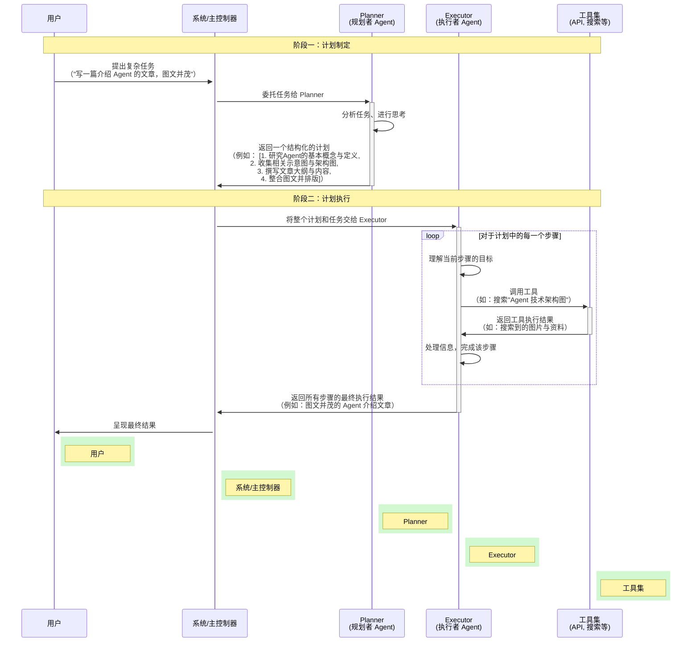

# 动手打造一个自动发 KM 的 Agent

> 最终卡在了发布 KM 的工具上 😄😄😄
>
> 本文通过案例来介绍如何实现一个 Agent

## 1. 故事是这样开始的

很久没写文章了，这两天想写一篇，但你最近确实有点小忙（其实主要是有点懒了），不想自己写，好吧，那就交给 AI 了。

打开元宝，输入 "写一篇介绍 Agent 的文章，需要图文并茂"。


**图 1： 元宝输出文章结果**

吭哧吭哧，写了一大堆，但离你直接发 KM 的目标还远着呢，不仅排版不是你喜欢的风格，图片还是这样子的😳😳😳。


**图 2： 元宝输出文章图片说明**

很明显，输出的内容你没办法直接使用，完全没有达到预期的效果，还需要做很多事情

- 将文字复制到自己熟悉的文稿里并重新排版
- 自己绘制图片或者把返回的图片说明丢到 midjourney 或者文生图模型里
- 复制图片并填入到文档中
- 填入图片后，需要修改图片说明使得说明和图片契合，因此重新把文稿发给 LLM
- 修改完后发布到 KM

这时候，聪明的你就在想，要是这些都能自动做就好了，大脑开始疯狂思考：

- 复制文稿并排版 —— 是不是提供一个 WriteDocumentToFile 工具就可以解决了
- 绘制图片 —— 提供一个 DrawImage 工具就行了
- 重新发送给 LLM —— 提供一个 ReadDocument 和 SendMessageToLLM 就能解决了
- 发布到 KM —— 提供一个PublishToKM 工具

假设这些工具都完备了，并且 LLM 可以自己地去按需调用这些工具和根据工具的反馈决定是否继续是结束还是继续调用，那么，**这最后一公里的问题就得到了解决，AI 也就是真 AI 了**。

## 2. ReAct

可是要怎么做呢？怎么才能让 LLM 按照你的预期轨迹来走呢？

这肯定难不倒聪明的你，你知道，站在巨人肩膀上可以更快地解决问题。于是，你找到了 2022 年 10 月份的一篇论文， https://arxiv.org/abs/2210.03629 这篇论文提出了一种称为 ReAct 的模式，它介绍了如何将模型的**推理**和**行动**能力**协同地、交错地**结合起来。简单来说，就是让模型在解决一个任务时，交替生成**推理轨迹**和**具体行动**，先推理（思考），然后再行动，并一直重复这个动作，直到得到结果。

于是，你深入地研究了一下它，原来它的模式是这样的：


图 3： ReAct 模式简图


图 4： ReAct 模式流程图

模式虽然有了，但现在又引入了新的问题了，怎么才能让 LLM 每次先推理，然后再行动并且通过交互反馈(结果)来控制模型的行为（继续调用 LLM 还是输出）呢？

好吧，聪明的你肯定想到了，**奥秘就在问题上**，**告诉 LLM，让它每次先推理，再行动，再根据结果做下一步行为不就好了**；也就是系统提示词，system prompt。

要不你验证一下，看看是不是真的可以做到，于是，你写了如下的系统提示词来做实现，并在 deepseek 中做了实验。

> 温馨提示：为减小篇幅，此处提示词并不完整，完整提示词请查看附录 1

```tex
你是一个写技术文章的专家，你需要根据用户的输入写文章，请遵循 Thought → Action → Observation → … → Final Answer 的过程
1. 首先思考要做什么 <Thought>
2. 然后查看是否有可用工具 <Action>
3. 然后你将根据你的行动从上下文/工具中收到一个结果 <Observation>
4. 持续这个思考和行动的过程，直到你有足够的信息来提供 <Final Answer>
5. 最后，把文章内容写入到文件中

⸻

请严格遵守：
- 每次回答都必须包括两个标签，第一个是 <Thought>，第二个是 <Action> 或 <Final Answer>
- 输出 <Action> 后立即停止生成，等待返回的 <Observation>
- 把图片描述使用绘制好的的图片 url 替换，并使用 markdown 格式来输出
- 最后把写入到文件中时，请先检查是否可以写入，如果不可以写入，请直接以 Markdown 格式输出文章内容
⸻

可用工具：
drawImage;checkCanWrite;writeToMd
```

图5：ReAct 提示词（简洁版）


图6：DeepSeek 模拟 ReAct 


图7：DeepSeek 模拟 ReAct 


原来真的可以呀，哇，太神奇了。

既然手动实验成功了，那自然肯定可以用代码让整个流程自动化起来对吧，于是，你便开始吭哧吭哧写代码了，一起来看看吧。

> 温馨提示：为减小篇幅，此处代码并不完整，完整代码 demo 请查看附录 2

```ts
export class ReActAgent {
    async run(userInput: string): Promise<string> {
        const messages: Message[] = [
            { role: 'system', content: this.renderSystemPrompt(reActSystemPrompt) },
            { role: 'user', content: `<Question>${userInput}</Question>` }
        ];

        while (true) {
            // 请求模型
            const content = await this.callModel(messages);

            // 检测 Thought
            const thoughtMatch = content.match(/<Thought>(.*?)<\/Thought>/s);

            // 检测模型是否输出 Final Answer，如果是的话，直接返回
            if (content.includes('<Final Answer>')) {}

            // 检测 Action
            const actionMatch = content.match(/<Action>(.*?)<\/Action>/s);
            
            const action = actionMatch[1];

            // 从 Action 中解析出工具名和参数
            const [toolName, args] = this.parseAction(action);

            const tool = this.tools.get(toolName);
            // 调用工具
            const observation = await tool(...args);
            // 将 Observation 结果添加到消息中，并发送给模型
            const obsMsg = `<Observation>${observation}</Observation>`;
            messages.push({ role: 'user', content: obsMsg });
        }
    }
}

// ------------------------工具函数------------------------

// 绘制图片
export function drawImage(desc: string): string {}
// 写入到 markdown 文件
export function writeToMd(filePath: string, content: string): string {}
// 检查是否可以写入
export function checkCanWrite(fileName: string): string {}
```

到此，一个简单的 ReAct 就完成了，是不是很简单呀，离你自动发 KM 的距离不远了，还差什么？问题就留给你啦。

## 3. Plan-and-Execute

ReAct 的模式确实能完成你的任务，但买东西还得对比一下呢？ ReAct 是交替地思考、行动、观察；是不是还可以先就把整个任务计划规划好，然后再按照计划一步步执行呢？

当然可以，于是，你又找到了 langchain 的这篇文档 https://github.com/langchain-ai/langgraph/blob/main/docs/docs/tutorials/plan-and-execute/plan-and-execute.ipynb，它介绍了一种 plan-and-execute 模式，具体如下：




同样的，你也可以进行实现模拟，就是修改系统提示词，让 LLM 先做规划，然后再分步地去完整即可；这里就不赘述了。

## 4. 远不止此

虽然我们已经成功实现了一个能够自动写文章、画图并发布的 Agent，但这只是一个起点。当前这个 Agent 还相当简陋，要让它真正实用化，还有大量工作要做。

### 4.1 简陋的现状

#### 4.1.1**记忆能力的缺失**

我们目前的 Agent 是"健忘的"——每次对话都是全新的开始。在实际应用中，Agent 需要：

- 记住用户的偏好（比如你喜欢的排版风格、图片样式）
- 保持会话上下文，避免重复工作
- 学习历史经验，优化执行策略

#### 4.1.2 **错误处理与鲁棒性**

现在的 Agent 就像个脆弱的瓷器：

```typescript
// 当前：工具调用失败就整个流程崩溃
const observation = await tool(...args);

// 需要：完善的错误处理机制
try {
    const observation = await tool(...args);
} catch (error) {
    // 让 LLM 知道工具调用失败，并决定如何继续
    return `<Observation>工具调用失败：${error.message}，请调整策略重试</Observation>`;
}
```

#### 4.1.3 **执行效率问题**

- ReAct 的逐步执行虽然可靠，但速度较慢
- 缺乏并行处理能力（比如图片生成和文字排版可以同时进行）
- 没有执行超时和中断机制

### 4.2 真正的挑战：提示词与工具

#### 4.2.1 **系统提示词的艺术**

Agent 框架本身并不复杂，真正的魔法藏在提示词里：

```typescript
// 简单的框架
class SimpleAgent {
    async run(prompt: string, tools: Tool[]) {
        // 核心就是：调用 LLM + 执行工具
    }
}
```

但要让这个框架真正工作，需要精心设计的提示词：
- **角色定义**：明确 Agent 的身份和职责边界
- **输出约束**：强制结构化输出，便于程序解析
- **推理引导**：教会 LLM 如何"思考"，而不仅仅是"回答"
- **错误预防**：预判可能的问题，在提示词中提前防范

#### 4.2.2 **工具生态的建设**

工具才是 Agent 能力的延伸，而工具的开发维护才是真正的大头：

```typescript
// 一个完整的工具需要考虑很多因素
class PublishToKMTool {
    async execute(content: string): Promise<string> {
        // 1. 权限验证
        // 2. 内容审核  
        // 3. 格式转换
        // 4. 发布接口调用
        // 5. 错误重试机制
        // 6. 结果验证
        // ... 几十行甚至上百行代码
    }
}
```

每个工具都需要：
- 完善的输入验证
- 健壮的错误处理
- 详细的日志记录
- 版本兼容性考虑

## 5. 重新认识 Agent 开发

通过这个实践，你应该认识到了：

### 5.1 **Agent 框架是简单的，智能是借来的**

- Agent 框架本质是"流程控制器"
- 真正的智能来自 LLM，框架只是提供了使用智能的方式
- 不要过度设计框架，而忽视了提示词和工具的质量

### 5.2 **工具质量决定 Agent 上限**

- 再聪明的 Agent，如果工具不可靠，也是"巧妇难为无米之炊"
- 工具的开发、测试、维护占据了大部分工作量
- 工具的设计要面向真实业务场景，而非理想情况

### 5.3 **提示词工程是核心竞争力**

- 同样的框架，不同的提示词，效果天差地别
- 提示词需要持续迭代优化，基于真实使用反馈
- 好的提示词要让 LLM 既保持创造性，又遵守规则约束

所以，如果你想要打造真正实用的 Agent，打磨高质量的工具体系**和**精心设计系统提示词是核心。


#


## 附录

### 附录1：ReAct 完整提示词

```
你是一个写技术文章的专家，你需要根据用户的输入写文章，请遵循 Thought → Action → Observation → … → Final Answer 的过程
1. 首先思考要做什么 <Thought>
2. 然后查看是否有可用工具 <Action>
3. 然后你将根据你的行动从上下文/工具中收到一个结果 <Observation>
4. 持续这个思考和行动的过程，直到你有足够的信息来提供 <Final Answer>
5. 最后，把文章内容写入到文件中

所有步骤请严格使用以下 XML 标签格式输出：
- <Question> 用户问题
- <Thought> 思考
- <Action> 采取的工具操作
- <Observation> 工具或环境返回的结果
- <Final Answer> 最终答案

⸻

例子 1:

<Question>写一篇关于 javascript Map 的文章，图文并茂</Question>
<Thought>好的，那么开始写文章。此处是文章内容，文章内容省略；图片内容通过文字返回的，可以使用 drawImage 工具来绘制图片</Thought>
<Action>drawImage('Map 一个示意图，左侧是键的区域，包含各种数据类型如字符串、数字、对象、函数等；右侧是值的区域，包含各种数据')</Action>
<Observation>图片绘制成功，图片 url: https://developer.mozilla.org/zh-CN/docs/Web/JavaScript/Reference/Global_Objects/Set/intersection/diagram.svg</Observation>
<Thought>我已经写完整个文章了，其中图片描述用图片 url 替换了。可以回答问题了</Thought>
<Final Answer>文章内容输出</Final Answer>

⸻

请严格遵守：
- 每次回答都必须包括两个标签，第一个是 <Thought>，第二个是 <Action> 或 <Final Answer>
- 输出 <Action> 后立即停止生成，等待返回的 <Observation>
- 把图片描述使用绘制好的的图片 url 替换，并使用 markdown 格式来输出
- 最后把写入到文件中时，请先检查是否可以写入，如果不可以写入，请直接以 Markdown 格式输出文章内容
⸻

可用工具：
{
  "type": "function",
  "function": {
    "name": "drawImage",
    "description": "根据输入的描述绘制图片",
    "parameters": {
      "type": "string",
      "properties": {
        "desc": {
          "type": "string",
          "description": "输入的图片描述"
        }
      },
      "required": ["desc"]
    }
  }
}
{
  "type": "function",
  "function": {
    "name": "checkCanWrite",
    "description": "检查文件是否可以写入",
    "parameters": {
      "type": "string",
      "properties": {
        "fileName": {
          "type": "string",
          "description": "输入的文件名"
        }
      },
      "required": ["fileName"]
    }
  }
}
{
  "type": "function",
  "function": {
    "name": "writeToMd",
    "description": "写入到文件中",
    "parameters": {
      "type": "string",
      "properties": {
        "fileName": {
          "type": "string",
          "description": "输入的文件名"
        },
        "content": {
          "type": "string",
          "description": "内容"
        }
      },
      "required": ["fileName", "content"]
    }
  }
}
```


